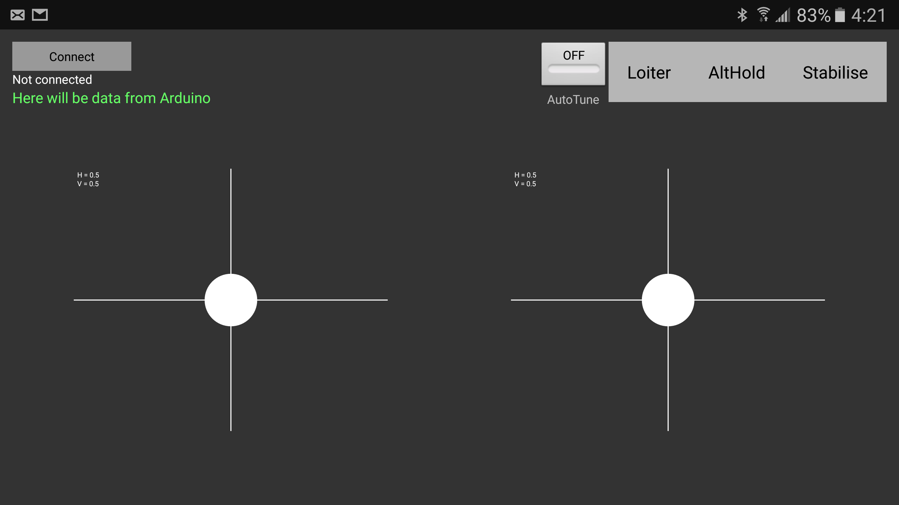
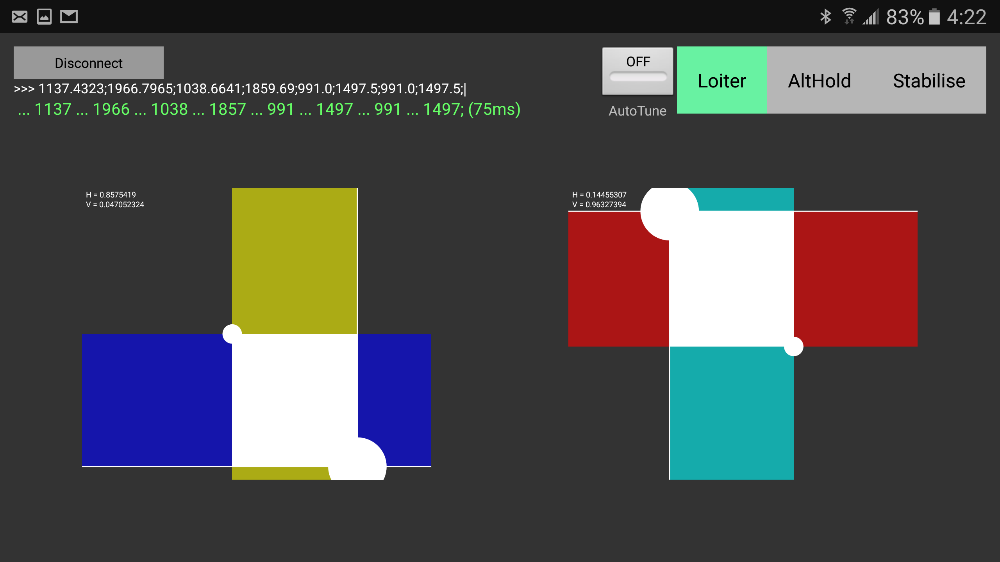

# AndroidBtSticks
This project allows you to control your quadcopter from your android using JR module from your control and Arduino.
 
 Hello! This project allows you to control your quadcopter from your android using JR module from your control and Arduino. 
 
 The main purpose to build it is making possible control drone without massive control, using only JR module with phone instead.
 To run tris project:
 0) Make sure you have JR module inside your RC control and Anroid device. Make sure your JR module paired to your receiver on drone.
 1) Get Arduino Nano \ Uno, get Bluetooth module for Arduino, wires, etc., install Arduino software and Android Studio.
 2) Connect Arduino to JR module. To run JR module enough to connect 3 wires: +5v (BAT+), GND and PPM. Pin10 on Arduino is PPM out. 
 3) Connect arduino to PC, flash firmware from Generate_PPM_signal.ino.
 4) Disconnect Arduino from PC and connect Bluetooth modulle RX wire connect to TX between Arduino and BT. Then connect it all to any power supply or PC.
 5) Open code of Android application, in file "BluetoothArduino.java" change name from "Dr. Failov:Arduino" to your Bluetooth module name.
 In case if you don't want to rebuild all the apk, rename your module to "Dr. Failov:Arduino" and built program will work with it.
 Also, you can change behaviour of channels by editind refresh() finction in MainActivity.java.
 Program with Arduino communicates using data in such format: 1200;1300;1400;1500;1700;1800;1900;2000;|
 Where numbers is PWM walue for any of 8 channels.
 6) Install\biuld application to your phone. 
 7) Open it, press Connect. If all success, you will see something like
  ... 1200 ... 1300 ... 1400 ... 1500 ... 1700 ... 1800 ... 1900 ... 2000; (60ms)
 as on Screenshot_20161210-042212.png
 60ms is time which needed to process text data by arduino. Just for debugging. 
 If this time will be bigger than 90ms you will NEED to enlarge delay between sends of data on 156 line of MainActivity.java
 
 Happy flying!
 
 
 
 JR Modules pinout can be found here:
 http://www.rc-cam.com/forum/uploads/post-6-1157403137.jpg
 But looks like in some cases pinouts can differ between models. Double-check pinout of your module before use
 
 Thanks to Hasi, for sharing code to write PPM for Arduino:
 https://www.rcgroups.com/forums/showthread.php?1808432-Arduino-ppm-signal-reader-and-generator
 

  
  

